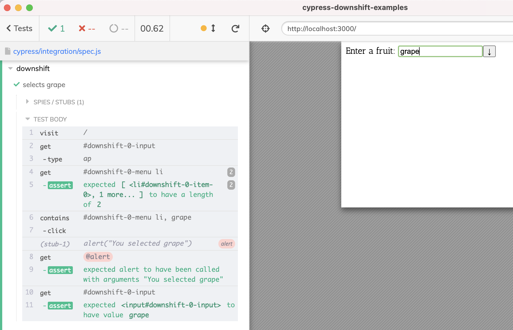

# cypress-downshift-examples
> Testing Downshift component using Cypress

This repo was downloaded from [this code sandbox](https://codesandbox.io/s/github/kentcdodds/downshift-examples) that collects examples of using [Downshift.js](https://www.downshift-js.com/) by Kent C Dodds.

See the tests in [cypress/integration/spec.js](./cypress/integration/spec.js) and other files inside [cypress/integration](./cypress/integration) folder.

## Videos

Example | Spec | Video(s)
---|---|---
[00-get-root-props-example](./downshift/ordered-examples/00-get-root-props-example) | [spec](./cypress/integration/spec.js) | [Testing A Basic Downshift.js Dropdown Example](https://youtu.be/0lnOnO84nvY), [Test A Downshift.js Dropdown Using Keyboard](https://youtu.be/HC0T9aEO6yM)
